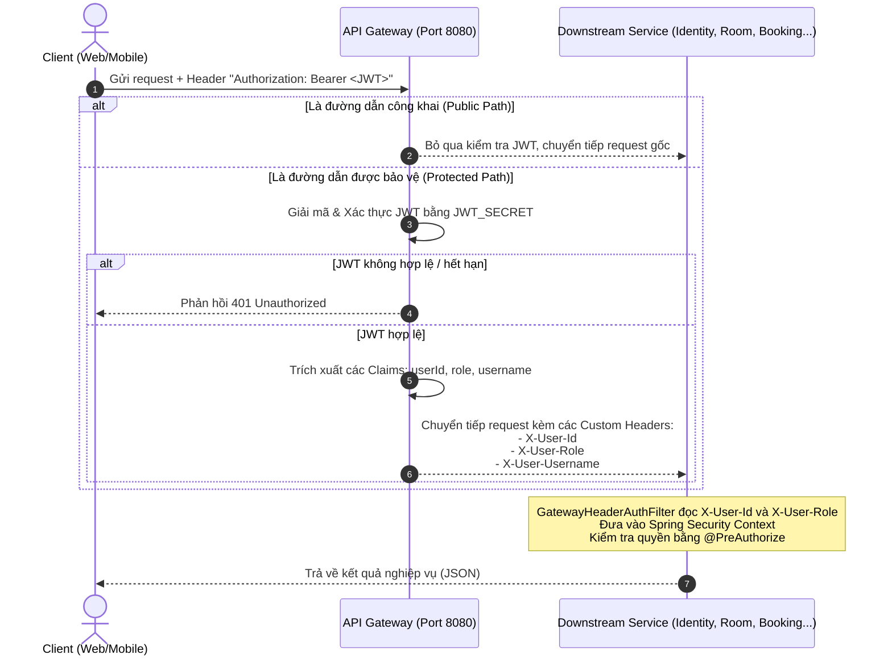

# Bản đồ API & Phân quyền Hệ thống (Smart Hotel PMS)

Tài liệu này cung cấp danh mục toàn bộ các REST API trong hệ thống **Smart Hotel PMS**, bản đồ phân quyền tương ứng, cùng cơ chế xác thực và truyền nhận thông tin định danh giữa **API Gateway** và các **Downstream Microservices**.

---

## 1. Cơ chế Xác thực & Phân quyền Hệ thống

Hệ thống sử dụng cơ chế bảo mật phân tán dựa trên **JWT Token** và các **HTTP Headers nội bộ** để tối ưu hóa hiệu năng và bảo vệ bề mặt tấn công.

### Luồng xử lý yêu cầu (Request Lifecycle)

### Cách API Gateway và Downstream Service nhận diện User:
1. **Tại API Gateway (`api-gateway`):**
   * Đối với các cổng công khai (**Public Paths**): Bỏ qua xác thực, không yêu cầu Token.
   * Đối với các cổng bảo vệ (**Protected Paths**): Đọc HTTP Header `Authorization: Bearer <JWT>`. Giải mã để lấy các Claims:
     * `userId` -> Ghi nhận và chuyển tiếp dưới dạng HTTP Header `X-User-Id`.
     * `role` -> Ghi nhận và chuyển tiếp dưới dạng HTTP Header `X-User-Role`.
     * `username` -> Ghi nhận và chuyển tiếp dưới dạng HTTP Header `X-User-Username`.
   * **Lưu ý quan trọng về Header:** Header phân quyền chính xác được dùng trong hệ thống là **`X-User-Role`** (dạng số ít), chứ không phải *`X-User-Roles`*.

2. **Tại Downstream Service (Các dịch vụ con):**
   * Sử dụng bộ lọc [GatewayHeaderAuthFilter](file:///c:/Users/vuong/IdeaProjects/smart-hotel-pms/business-services/common-shared/src/main/java/com/smarthotel/common_shared/security/GatewayHeaderAuthFilter.java) (được định nghĩa trong `common-shared`).
   * Bộ lọc này sẽ tự động đọc `X-User-Id` làm định danh User (`Principal`) và `X-User-Role` làm danh sách quyền (`GrantedAuthority`).
   * Phân quyền tại controller được kiểm soát chặt chẽ bằng cách sử dụng annotation `@PreAuthorize("hasRole('...')")` hoặc `@PreAuthorize("hasAnyRole('...', '...')")`.

---

## 2. Bảng Danh mục API & Bản đồ Phân quyền

Dưới đây là bảng liệt kê toàn bộ các API hiện có trong hệ thống **Smart Hotel PMS**:

| # | Service | Method & Endpoint | Phân quyền yêu cầu | Mục đích nghiệp vụ | Cách API Gateway & Downstream nhận diện |
| :--- | :--- | :--- | :--- | :--- | :--- |
| **1** | **Identity** | `POST /identity-service/api/auth/register` | **PermitAll** | Đăng ký tài khoản khách hàng mới (mặc định gán vai trò `ROLE_CUSTOMER`). | Bỏ qua xác thực JWT tại Gateway. |
| **2** | **Identity** | `POST /identity-service/api/auth/login` | **PermitAll** | Đăng nhập hệ thống, trả về JWT Token. | Bỏ qua xác thực JWT tại Gateway. |
| **3** | **Identity** | `GET /identity-service/api/auth/validate` | **PermitAll** | Xác thực tính hợp lệ của token JWT. | Bỏ qua xác thực JWT tại Gateway. |
| **4** | **Identity** | `POST /identity-service/api/auth/refresh` | **PermitAll** | Làm mới token JWT khi hết hạn. | Bỏ qua xác thực JWT tại Gateway. |
| **5** | **Identity** | `GET /identity-service/api/auth/users/{id}` | Mọi user đã đăng nhập | Tra cứu chi tiết thông tin tài khoản người dùng theo ID. | Gateway giải mã JWT và đẩy qua header `X-User-Id`. |
| **6** | **Identity** | `POST /identity-service/api/users` | **ROLE_ADMIN** | Admin tạo tài khoản người dùng với vai trò tùy chọn (ADMIN, RECEPTIONIST, STAFF, CUSTOMER). | Gateway giải mã JWT -> đẩy `X-User-Role`. Downstream kiểm tra qua `@PreAuthorize`. |
| **7** | **Identity** | `GET /identity-service/api/users` | **ROLE_ADMIN** | Admin lấy danh sách toàn bộ tài khoản người dùng trong hệ thống. | Gateway giải mã JWT -> đẩy `X-User-Role`. Downstream kiểm tra qua `@PreAuthorize`. |
| **8** | **Identity** | `PUT /identity-service/api/users/{id}/role` | **ROLE_ADMIN** | Admin thay đổi vai trò/quyền hạn của một tài khoản. | Gateway giải mã JWT -> đẩy `X-User-Role`. Downstream kiểm tra qua `@PreAuthorize`. |
| **9** | **Identity** | `PUT /identity-service/api/users/{id}/block` | **ROLE_ADMIN** | Admin thực hiện khóa hoặc mở khóa tài khoản người dùng. | Gateway giải mã JWT -> đẩy `X-User-Role`. Downstream kiểm tra qua `@PreAuthorize`. |
| **10** | **Room** | `GET /room-service/api/rooms/search` | **PermitAll** | Tìm kiếm danh sách các phòng trống trong khoảng thời gian xác định. | Bỏ qua xác thực JWT tại Gateway (Public Path). |
| **11** | **Room** | `POST /room-service/api/rooms` | **ROLE_ADMIN** | Admin tạo mới thông tin phòng vật lý trong khách sạn. | Gateway giải mã JWT -> đẩy `X-User-Role`. Downstream kiểm tra qua `@PreAuthorize`. |
| **12** | **Room** | `PUT /room-service/api/rooms/{id}/status` | **ROLE_RECEPTIONIST**, **ROLE_ADMIN** | Cập nhật trạng thái vật lý của phòng (ví dụ: OCCUPIED, CLEANING, AVAILABLE). | Gateway giải mã JWT -> đẩy `X-User-Role`. Downstream kiểm tra qua `@PreAuthorize`. |
| **13** | **Room** | `PUT /room-service/api/rooms/{id}` | **ROLE_ADMIN** | Admin cập nhật thông tin chi tiết một phòng vật lý. | Gateway giải mã JWT -> đẩy `X-User-Role`. Downstream kiểm tra qua `@PreAuthorize`. |
| **14** | **Room** | `DELETE /room-service/api/rooms/{id}` | **ROLE_ADMIN** | Admin xóa một phòng vật lý khỏi hệ thống. | Gateway giải mã JWT -> đẩy `X-User-Role`. Downstream kiểm tra qua `@PreAuthorize`. |
| **15** | **Room** | `GET /room-service/api/rooms/all` | **ROLE_ADMIN**, **ROLE_RECEPTIONIST** | Lấy toàn bộ danh sách phòng vật lý phục vụ trang quản lý kho phòng. | Gateway giải mã JWT -> đẩy `X-User-Role`. Downstream kiểm tra qua `@PreAuthorize`. |
| **16** | **Room** | `GET /room-service/api/rooms/{id}` | Mọi user đã đăng nhập | Tra cứu thông tin chi tiết của một phòng vật lý bằng ID. | Gateway giải mã JWT. Downstream cho phép truy cập sau khi xác thực thành công. |
| **17** | **Room** | `GET /room-service/api/rooms` | Mọi user đã đăng nhập | Lấy danh sách toàn bộ các phòng đang ở trạng thái trống hiện tại. | Gateway giải mã JWT. Downstream cho phép truy cập sau khi xác thực thành công. |
| **18** | **Booking** | `POST /booking-service/api/bookings` | **ROLE_CUSTOMER**, **ROLE_RECEPTIONIST**, **ROLE_ADMIN** | Khách hàng tự đặt phòng trực tuyến hoặc lễ tân đặt giúp. | Gateway giải mã JWT -> đẩy `X-User-Id` và `X-User-Role`. |
| **19** | **Booking** | `POST /booking-service/api/bookings/walk-in` | **ROLE_RECEPTIONIST**, **ROLE_ADMIN** | Đặt phòng và nhận phòng trực tiếp ngay lập tức cho khách vãng lai (Walk-in). | Gateway giải mã JWT -> đẩy `X-User-Role`. Downstream kiểm tra qua `@PreAuthorize`. |
| **20** | **Booking** | `POST /booking-service/api/bookings/{id}/check-in` | **ROLE_RECEPTIONIST**, **ROLE_ADMIN** | Làm thủ tục nhận phòng (Check-in) cho khách đã đặt phòng trước đó. | Gateway giải mã JWT -> đẩy `X-User-Role`. Downstream kiểm tra qua `@PreAuthorize`. |
| **21** | **Booking** | `GET /booking-service/api/bookings/{id}/pre-checkout-summary` | **ROLE_RECEPTIONIST**, **ROLE_ADMIN** | Xem bảng tóm tắt chi phí tạm tính (tiền phòng + dịch vụ chưa trả) trước khi checkout. | Gateway giải mã JWT -> đẩy `X-User-Role`. Downstream kiểm tra qua `@PreAuthorize`. |
| **22** | **Booking** | `POST /booking-service/api/bookings/{id}/check-out` | **ROLE_RECEPTIONIST**, **ROLE_ADMIN** | Thủ tục trả phòng (Check-out), giải phóng phòng sang DIRTY, ghi nhận kết thúc đơn đặt. | Gateway giải mã JWT -> đẩy `X-User-Role`. Downstream kiểm tra qua `@PreAuthorize`. |
| **23** | **Booking** | `GET /booking-service/api/bookings/my-bookings` | **ROLE_CUSTOMER**, **ROLE_RECEPTIONIST**, **ROLE_ADMIN** | Khách hàng tự tra cứu danh sách đơn đặt phòng của chính mình. | Gateway giải mã JWT và đẩy mã định danh vào `X-User-Id` để kiểm tra quyền sở hữu. |
| **24** | **Booking** | `GET /booking-service/api/bookings/{id}` | **ROLE_CUSTOMER**, **ROLE_RECEPTIONIST**, **ROLE_ADMIN** | Lấy thông tin chi tiết của một đơn đặt phòng bằng ID đơn. | Gateway giải mã JWT -> đẩy `X-User-Role`. Downstream kiểm tra qua `@PreAuthorize`. |
| **25** | **Booking** | `GET /booking-service/api/bookings` | **ROLE_RECEPTIONIST**, **ROLE_ADMIN** | Lấy danh sách toàn bộ các đơn đặt phòng trong hệ thống. | Gateway giải mã JWT -> đẩy `X-User-Role`. Downstream kiểm tra qua `@PreAuthorize`. |
| **26** | **Booking** | `PUT /booking-service/api/bookings/{id}` | **ROLE_RECEPTIONIST**, **ROLE_ADMIN** | Cập nhật thông tin chi tiết một đơn đặt phòng. | Gateway giải mã JWT -> đẩy `X-User-Role`. Downstream kiểm tra qua `@PreAuthorize`. |
| **27** | **Booking** | `DELETE /booking-service/api/bookings/{id}` | **ROLE_ADMIN** | Xóa một đơn đặt phòng ra khỏi cơ sở dữ liệu hệ thống. | Gateway giải mã JWT -> đẩy `X-User-Role`. Downstream kiểm tra qua `@PreAuthorize`. |
| **28** | **Booking** | `GET /booking-service/api/bookings/active-room-ids` | Mọi user đã đăng nhập (Gọi nội bộ/Feign) | Lấy danh sách ID các phòng bận trong khoảng thời gian phục vụ cho việc kiểm tra chéo. | Gateway yêu cầu xác thực JWT. Không có giới hạn vai trò ở downstream. |
| **29** | **Booking** | `GET /booking-service/api/bookings/check-availability` | Mọi user đã đăng nhập (Gọi nội bộ/Feign) | Kiểm tra xem một phòng cụ thể có trống trong thời gian yêu cầu hay không. | Gateway yêu cầu xác thực JWT. Không có giới hạn vai trò ở downstream. |
| **30** | **Booking** | `POST /booking-service/api/bookings/{id}/pay-deposit` | **ROLE_CUSTOMER**, **ROLE_RECEPTIONIST**, **ROLE_ADMIN** | Khách hàng thực hiện đặt cọc trước cho đơn đặt phòng. | Gateway giải mã JWT -> đẩy `X-User-Role`. Downstream kiểm tra qua `@PreAuthorize`. |
| **31** | **Booking** | `POST /booking-service/api/bookings/{id}/no-show` | **ROLE_RECEPTIONIST**, **ROLE_ADMIN** | Đánh dấu đơn đặt phòng là No-Show khi khách không đến nhận phòng. | Gateway giải mã JWT -> đẩy `X-User-Role`. Downstream kiểm tra qua `@PreAuthorize`. |
| **32** | **Amenities** | `POST /amenities-service/api/amenities` | **ROLE_ADMIN**, **ROLE_RECEPTIONIST** | Thêm loại dịch vụ tiện ích mới vào danh mục phục vụ của khách sạn. | Gateway giải mã JWT -> đẩy `X-User-Role`. Downstream kiểm tra qua `@PreAuthorize`. |
| **33** | **Amenities** | `GET /amenities-service/api/amenities` | **ROLE_CUSTOMER**, **ROLE_STAFF**, **ROLE_RECEPTIONIST**, **ROLE_ADMIN** | Lấy toàn bộ danh sách dịch vụ tiện ích hiện có trong danh mục. | Gateway giải mã JWT -> đẩy `X-User-Role`. Downstream kiểm tra qua `@PreAuthorize`. |
| **34** | **Amenities** | `GET /amenities-service/api/amenities/{id}` | **ROLE_CUSTOMER**, **ROLE_STAFF**, **ROLE_RECEPTIONIST**, **ROLE_ADMIN** | Truy vấn thông tin chi tiết một dịch vụ tiện ích bằng ID dịch vụ. | Gateway giải mã JWT -> đẩy `X-User-Role`. Downstream kiểm tra qua `@PreAuthorize`. |
| **35** | **Amenities** | `POST /amenities-service/api/amenities/order` | **ROLE_CUSTOMER**, **ROLE_RECEPTIONIST**, **ROLE_ADMIN** | Khách hàng hoặc lễ tân đặt dịch vụ phòng (trạng thái ban đầu PENDING). | Gateway giải mã JWT -> đẩy `X-User-Role`. Downstream kiểm tra qua `@PreAuthorize`. |
| **36** | **Amenities** | `GET /amenities-service/api/amenities/orders` | **ROLE_STAFF**, **ROLE_RECEPTIONIST**, **ROLE_ADMIN** | Xem danh sách đơn gọi dịch vụ phòng lọc theo trạng thái (cho màn hình chờ của bếp/nhân viên). | Gateway giải mã JWT -> đẩy `X-User-Role`. Downstream kiểm tra qua `@PreAuthorize`. |
| **37** | **Amenities** | `PUT /amenities-service/api/amenities/orders/{id}/status` | **ROLE_STAFF**, **ROLE_RECEPTIONIST**, **ROLE_ADMIN** | Cập nhật tiến độ xử lý dịch vụ (ví dụ: PENDING -> PREPARING -> DELIVERED). | Gateway giải mã JWT -> đẩy `X-User-Role`. Downstream kiểm tra qua `@PreAuthorize`. |
| **38** | **Amenities** | `GET /amenities-service/api/amenities/room/{roomId}/unpaid` | **ROLE_RECEPTIONIST**, **ROLE_ADMIN**, **ROLE_STAFF** | Lấy danh sách dịch vụ chưa thanh toán theo phòng (gọi nội bộ từ Billing khi checkout). | Gateway giải mã JWT -> đẩy `X-User-Role`. Downstream kiểm tra qua `@PreAuthorize`. |
| **39** | **Amenities** | `GET /amenities-service/api/amenities/booking/{bookingId}/unpaid` | **ROLE_RECEPTIONIST**, **ROLE_ADMIN**, **ROLE_STAFF** | Lấy danh sách dịch vụ chưa thanh toán theo booking (gọi nội bộ từ Billing khi checkout). | Gateway giải mã JWT -> đẩy `X-User-Role`. Downstream kiểm tra qua `@PreAuthorize`. |
| **40** | **Amenities** | `GET /amenities-service/api/amenities/orders/booking/{bookingId}/unpaid-charge` | Mọi user đã đăng nhập (Gọi nội bộ/Feign) | Lấy tổng tiền dịch vụ phòng chưa trả của một đơn đặt phòng (phục vụ Billing Service). | Gateway yêu cầu xác thực JWT. Không có giới hạn vai trò ở downstream. |
| **41** | **Housekeeping** | `GET /housekeeping-service/api/housekeeping/dirty-rooms` | **ROLE_STAFF**, **ROLE_ADMIN**, **ROLE_RECEPTIONIST** | Lấy danh sách toàn bộ các phòng bẩn (DIRTY) để nhân viên buồng phòng nhận dọn dẹp. | Gateway giải mã JWT -> đẩy `X-User-Role`. Downstream kiểm tra qua `@PreAuthorize` ở mức class. |
| **42** | **Housekeeping** | `GET /housekeeping-service/api/housekeeping/tasks` | **ROLE_STAFF**, **ROLE_ADMIN**, **ROLE_RECEPTIONIST** | Lấy danh sách công việc dọn dẹp phòng (lọc theo trạng thái/nhân viên). | Gateway giải mã JWT -> đẩy `X-User-Role`. Downstream kiểm tra qua `@PreAuthorize` ở mức class. |
| **43** | **Housekeeping** | `POST /housekeeping-service/api/housekeeping/tasks/{id}/start` | **ROLE_STAFF**, **ROLE_ADMIN**, **ROLE_RECEPTIONIST** | Nhận việc và bắt đầu dọn phòng. Đổi trạng thái sang IN_PROGRESS, ghi nhận nhân viên qua `X-User-Id`. | Gateway giải mã JWT -> đẩy `X-User-Id` và `X-User-Role` xuống downstream. |
| **44** | **Housekeeping** | `POST /housekeeping-service/api/housekeeping/tasks/{id}/complete` | **ROLE_STAFF**, **ROLE_ADMIN**, **ROLE_RECEPTIONIST** | Hoàn thành dọn phòng. Đổi trạng thái công việc sang COMPLETED và phòng thành AVAILABLE. | Gateway giải mã JWT -> đẩy `X-User-Role`. Downstream kiểm tra qua `@PreAuthorize` ở mức class. |
| **45** | **Billing** | `POST /billing-service/api/invoices/generate` | **ROLE_RECEPTIONIST**, **ROLE_ADMIN** | Tạo hóa đơn tính tiền cho khách dựa trên booking và dịch vụ đi kèm chưa trả. | Gateway giải mã JWT -> đẩy `X-User-Role`. Downstream kiểm tra qua `@PreAuthorize` ở mức class. |
| **46** | **Billing** | `POST /billing-service/api/invoices/{id}/pay` | **ROLE_RECEPTIONIST**, **ROLE_ADMIN** | Khởi tạo quy trình thanh toán cho hóa đơn (xuất link thanh toán hoặc mã QR). | Gateway giải mã JWT -> đẩy `X-User-Role`. Downstream kiểm tra qua `@PreAuthorize` ở mức class. |
| **47** | **Billing** | `POST /billing-service/api/invoices/{id}/confirm-payment` | **ROLE_RECEPTIONIST**, **ROLE_ADMIN** | Xác nhận thanh toán hóa đơn thành công và chuyển trạng thái sang PAID. | Gateway giải mã JWT -> đẩy `X-User-Role`. Downstream kiểm tra qua `@PreAuthorize` ở mức class. |
| **48** | **Billing** | `GET /billing-service/api/invoices` | **ROLE_RECEPTIONIST**, **ROLE_ADMIN** | Lấy danh sách toàn bộ hóa đơn trong hệ thống. | Gateway giải mã JWT -> đẩy `X-User-Role`. Downstream kiểm tra qua `@PreAuthorize` ở mức class. |
| **49** | **Billing** | `GET /billing-service/api/invoices/stats` | **ROLE_ADMIN** | Thống kê doanh thu cho màn hình Dashboard tổng quan. | Gateway giải mã JWT -> đẩy `X-User-Role`. Quy tắc `@PreAuthorize` ở hàm ghi đè quyền của class chỉ cho ADMIN. |
| **50** | **Billing** | `GET /billing-service/api/invoices/{id}` | **ROLE_RECEPTIONIST**, **ROLE_ADMIN** | Tra cứu thông tin chi tiết một hóa đơn bằng ID. | Gateway giải mã JWT -> đẩy `X-User-Role`. Downstream kiểm tra qua `@PreAuthorize` ở mức class. |
| **51** | **Billing** | `GET /billing-service/api/invoices/booking/{bookingId}` | **ROLE_RECEPTIONIST**, **ROLE_ADMIN** | Tra cứu thông tin hóa đơn dựa trên ID đơn đặt phòng (bookingId). | Gateway giải mã JWT -> đẩy `X-User-Role`. Downstream kiểm tra qua `@PreAuthorize` ở mức class. |

---

## 3. Phân tích Bảo mật Bề mặt API (Security Analysis)

Từ kết quả quét hệ thống, có một số điểm quan trọng cần lưu ý để kiểm soát bề mặt bảo mật:

### 3.1. Cơ chế Chống Giả mạo Header (Anti-Spoofing Check)
* **Nguyên lý hoạt động:** API Gateway đóng vai trò là chốt chặn duy nhất mở ra internet. Client bên ngoài chỉ có thể giao tiếp với Gateway qua cổng `8080`.
* **Khả năng Spoofing:** Nếu một kẻ tấn công cố tình chèn header `X-User-Role: ROLE_ADMIN` và `X-User-Id` trực tiếp từ client nhằm giả mạo quyền admin:
  * **Trên các Protected Routes:** Khi đi qua Gateway, `AuthenticationFilter` sẽ tự động ghi đè (overwrite) các header này bằng các thông tin trích xuất thực tế từ chữ ký JWT của Token hợp lệ. Do đó, kẻ tấn công **không thể** giả mạo quyền hành trên các API được bảo vệ.
  * **Trên các Public Routes (ví dụ `/room-service/api/rooms/search`):** Gateway bỏ qua xác thực (`isPublicPath` trả về `true`), nghĩa là nó không thực hiện việc bọc request bằng `CustomHeaderRequestWrapper` và không ghi đè các header. Tuy nhiên, do các API này không thực hiện kiểm tra quyền (PermitAll downstream) nên việc chèn thêm header giả mạo tại đây không mang lại lợi ích tấn công trực tiếp.

### 3.2. Điểm cần lưu ý về Phân quyền Downstream
1. **Các API gọi chéo nội bộ (Internal APIs):**
   * Các API như `/booking-service/api/bookings/active-room-ids`, `/booking-service/api/bookings/check-availability` hoặc `/amenities-service/api/amenities/orders/booking/{bookingId}/unpaid-charge` không được cấu hình `@PreAuthorize` kiểm tra vai trò cụ thể.
   * Để tăng cường bảo mật, các API này nên được giới hạn cấu hình bảo mật hoặc chỉ cho phép gọi từ các service nội bộ (ví dụ: xác thực bằng Client Credentials hoặc chặn truy cập trực tiếp qua mạng nội bộ / chặn từ Gateway). Hiện tại, nếu kẻ tấn công có bất kỳ JWT hợp lệ nào (thậm chí là tài khoản `ROLE_CUSTOMER`), họ vẫn có thể gọi các API này thông qua Gateway do chúng không kiểm tra quyền cụ thể downstream.
2. **Ký tự chữ hoa/thường trong vai trò:**
   * Trong DB và token, vai trò được ghi nhận dưới dạng chuỗi có tiền tố `ROLE_` (ví dụ: `ROLE_ADMIN`).
   * Khi ánh xạ vào Spring Security thông qua `GatewayHeaderAuthFilter`, quyền này được giữ nguyên. Do đó, `@PreAuthorize("hasRole('ADMIN')")` sẽ tự động tìm kiếm Authority mang giá trị `ROLE_ADMIN`, đảm bảo tính khớp nối chuẩn xác.
