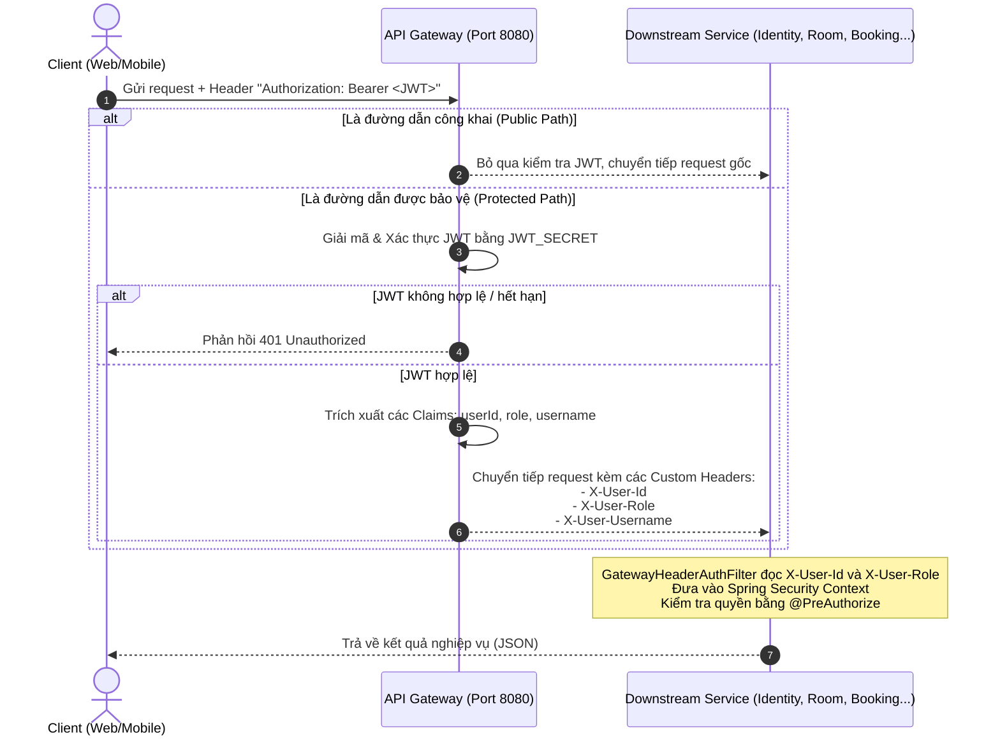

# Bản đồ API & Phân quyền Hệ thống (Smart Hotel PMS)

Tài liệu này cung cấp danh mục toàn bộ các REST API thực tế trong hệ thống **Smart Hotel PMS**, bản đồ phân quyền tương ứng, cùng cơ chế xác thực và truyền nhận thông tin định danh giữa **API Gateway** và các **Downstream Microservices**.

---

## 1. Cơ chế Xác thực & Phân quyền Hệ thống

Hệ thống sử dụng cơ chế bảo mật phân tán dựa trên **JWT Token** và các **HTTP Headers nội bộ** để tối ưu hóa hiệu năng và bảo vệ bề mặt tấn công.

### Luồng xử lý yêu cầu (Request Lifecycle)

### Cách API Gateway và Downstream Service nhận diện User:
1. **Tại API Gateway (`api-gateway`):**
   * Đối với các cổng công khai (**Public Paths**): Bỏ qua xác thực, không yêu cầu Token. Các public path được định nghĩa trong [AuthenticationFilter.java](file:///c:/Users/vuong/IdeaProjects/smart-hotel-pms/infrastructure-services/api-gateway/src/main/java/com/smarthotel/api_gateway/filter/AuthenticationFilter.java).
   * Đối với các cổng bảo vệ (**Protected Paths**): Đọc HTTP Header `Authorization: Bearer <JWT>`. Giải mã để lấy các Claims:
     * `userId` -> Chuyển tiếp dưới dạng HTTP Header `X-User-Id`.
     * `role` -> Chuyển tiếp dưới dạng HTTP Header `X-User-Role` (dạng số ít, ví dụ: `ROLE_ADMIN`).
     * `username` -> Chuyển tiếp dưới dạng HTTP Header `X-User-Username`.

2. **Tại Downstream Service (Các dịch vụ con):**
   * Sử dụng bộ lọc [GatewayHeaderAuthFilter](file:///c:/Users/vuong/IdeaProjects/smart-hotel-pms/business-services/common-shared/src/main/java/com/smarthotel/common_shared/security/GatewayHeaderAuthFilter.java) (được định nghĩa trong `common-shared`).
   * Bộ lọc này sẽ tự động đọc `X-User-Id` làm định danh User (`Principal`) và `X-User-Role` làm danh sách quyền (`GrantedAuthority`).
   * Phân quyền tại controller được kiểm soát chặt chẽ bằng cách sử dụng annotation `@PreAuthorize("hasRole('...')")` hoặc `@PreAuthorize("hasAnyRole('...', '...')")`.

---

## 2. Bảng Danh mục API & Bản đồ Phân quyền thực tế

Dưới đây là bảng liệt kê toàn bộ các API thực tế có trong mã nguồn của hệ thống **Smart Hotel PMS**:

| # | Service | Method & Endpoint | Phân quyền yêu cầu | Mục đích nghiệp vụ | Cách API Gateway & Downstream nhận diện |
| :--- | :--- | :--- | :--- | :--- | :--- |
| **1** | **Identity** | `POST /identity-service/api/auth/register` | **PermitAll** | Đăng ký tài khoản khách hàng mới (mặc định gán vai trò `ROLE_CUSTOMER`). | Bỏ qua xác thực JWT tại Gateway. |
| **2** | **Identity** | `POST /identity-service/api/auth/login` | **PermitAll** | Đăng nhập hệ thống, trả về JWT Token. | Bỏ qua xác thực JWT tại Gateway. |
| **3** | **Identity** | `GET /identity-service/api/auth/validate` | **PermitAll** | Xác thực tính hợp lệ của token JWT. | Bỏ qua xác thực JWT tại Gateway. |
| **4** | **Identity** | `POST /identity-service/api/auth/refresh` | **PermitAll** | Làm mới token JWT khi hết hạn. | Bỏ qua xác thực JWT tại Gateway. |
| **5** | **Identity** | `GET /identity-service/api/auth/users/{id}` | **ROLE_CUSTOMER (chỉ chính mình)**, **ROLE_RECEPTIONIST**, **ROLE_ADMIN** | Tra cứu chi tiết thông tin tài khoản người dùng theo ID (đối với CUSTOMER bắt buộc trùng với ID trong token). | Gateway giải mã JWT và đẩy qua header `X-User-Id`. |
| **6** | **Identity** | `POST /identity-service/api/users` | **ROLE_ADMIN** | Admin tạo tài khoản người dùng với vai trò tùy chọn. | Gateway giải mã JWT -> đẩy `X-User-Role`. |
| **7** | **Identity** | `GET /identity-service/api/users` | **ROLE_ADMIN** | Admin lấy danh sách toàn bộ tài khoản người dùng. | Gateway giải mã JWT -> đẩy `X-User-Role`. |
| **8** | **Identity** | `PUT /identity-service/api/users/{id}/role` | **ROLE_ADMIN** | Admin thay đổi vai trò/quyền hạn của một tài khoản. | Gateway giải mã JWT -> đẩy `X-User-Role`. |
| **9** | **Identity** | `PUT /identity-service/api/users/{id}/block` | **ROLE_ADMIN** | Admin thực hiện khóa hoặc mở khóa tài khoản người dùng. | Gateway giải mã JWT -> đẩy `X-User-Role`. |
| **10** | **Room** | `GET /room-service/api/rooms` | Mọi user đã đăng nhập | Lấy danh sách tất cả các phòng trống hiện tại. | Gateway giải mã JWT. Downstream cho phép truy cập sau khi xác thực. |
| **11** | **Room** | `GET /room-service/api/rooms/{id}` | Mọi user đã đăng nhập | Tra cứu thông tin chi tiết của một phòng vật lý bằng ID. | Gateway giải mã JWT. Downstream cho phép truy cập sau khi xác thực. |
| **12** | **Room** | `GET /room-service/api/rooms/all` | **ROLE_ADMIN**, **ROLE_RECEPTIONIST** | Lấy toàn bộ danh sách phòng vật lý phục vụ trang quản lý kho phòng. | Gateway giải mã JWT -> đẩy `X-User-Role`. |
| **13** | **Room** | `POST /room-service/api/rooms` | **ROLE_ADMIN** | Admin tạo mới thông tin phòng vật lý trong khách sạn. | Gateway giải mã JWT -> đẩy `X-User-Role`. |
| **14** | **Room** | `PUT /room-service/api/rooms/{id}` | **ROLE_ADMIN** | Admin cập nhật thông tin chi tiết một phòng vật lý. | Gateway giải mã JWT -> đẩy `X-User-Role`. |
| **15** | **Room** | `DELETE /room-service/api/rooms/{id}` | **ROLE_ADMIN** | Admin xóa một phòng vật lý khỏi hệ thống. | Gateway giải mã JWT -> đẩy `X-User-Role`. |
| **16** | **Room** | `PUT /room-service/api/rooms/{id}/status` | **ROLE_RECEPTIONIST**, **ROLE_ADMIN** | Cập nhật trạng thái vật lý của phòng (AVAILABLE, OCCUPIED, CLEANING...). | Gateway giải mã JWT -> đẩy `X-User-Role`. |
| **17** | **Booking** | `POST /booking-service/api/bookings` | **ROLE_CUSTOMER** | Khách hàng tự đặt phòng trực tuyến (mã nguồn downstream chỉ cho phép CUSTOMER). | Gateway giải mã JWT -> đẩy `X-User-Id` của khách hàng. |
| **18** | **Booking** | `POST /booking-service/api/bookings/walk-in` | **ROLE_RECEPTIONIST**, **ROLE_ADMIN** | Đặt phòng và check-in trực tiếp tại quầy cho khách vãng lai. | Gateway giải mã JWT -> đẩy `X-User-Role`. |
| **19** | **Booking** | `POST /booking-service/api/bookings/{id}/check-in` | **ROLE_RECEPTIONIST**, **ROLE_ADMIN** | Làm thủ tục nhận phòng cho khách đã đặt trước. | Gateway giải mã JWT -> đẩy `X-User-Role`. |
| **20** | **Booking** | `GET /booking-service/api/bookings/{id}/pre-checkout-summary` | **ROLE_RECEPTIONIST**, **ROLE_ADMIN** | Xem bảng tóm tắt chi phí tạm tính trước khi check-out thực tế. | Gateway giải mã JWT -> đẩy `X-User-Role`. |
| **21** | **Booking** | `POST /booking-service/api/bookings/{id}/check-out` | **ROLE_RECEPTIONIST**, **ROLE_ADMIN** | Làm thủ tục trả phòng, giải phóng phòng và kích hoạt saga tính hóa đơn. | Gateway giải mã JWT -> đẩy `X-User-Role`. |
| **22** | **Booking** | `GET /booking-service/api/bookings/my-bookings` | **ROLE_CUSTOMER** | Khách hàng tự tra cứu danh sách đặt phòng của mình (đã loại bỏ lễ tân và admin để tránh dư thừa). | Gateway giải mã JWT và đẩy mã định danh vào `X-User-Id`. |
| **23** | **Booking** | `GET /booking-service/api/bookings/{id}` | **ROLE_CUSTOMER (chỉ chính mình)**, **ROLE_RECEPTIONIST**, **ROLE_ADMIN** | Lấy thông tin chi tiết của một đơn đặt phòng bằng ID đơn (kiểm tra quyền sở hữu với CUSTOMER). | Gateway giải mã JWT -> đẩy `X-User-Role`. |
| **24** | **Booking** | `GET /booking-service/api/bookings` | **ROLE_RECEPTIONIST**, **ROLE_ADMIN** | Lấy danh sách toàn bộ các đơn đặt phòng trong hệ thống. | Gateway giải mã JWT -> đẩy `X-User-Role`. |
| **25** | **Booking** | `PUT /booking-service/api/bookings/{id}` | **ROLE_RECEPTIONIST**, **ROLE_ADMIN** | Cập nhật thông tin chi tiết một đơn đặt phòng. | Gateway giải mã JWT -> đẩy `X-User-Role`. |
| **26** | **Booking** | `DELETE /booking-service/api/bookings/{id}` | **ROLE_ADMIN** | Xóa một đơn đặt phòng ra khỏi cơ sở dữ liệu hệ thống. | Gateway giải mã JWT -> đẩy `X-User-Role`. |
| **27** | **Booking** | `GET /booking-service/api/bookings/active-room-ids` | Mọi user đã đăng nhập | Lấy danh sách ID các phòng bận trong khoảng thời gian (gọi nội bộ/Feign). | Gateway yêu cầu xác thực JWT. Không giới hạn vai trò downstream. |
| **28** | **Booking** | `GET /booking-service/api/bookings/search-available-rooms` | Mọi user đã đăng nhập | Tìm kiếm danh sách phòng trống thực tế trong khoảng thời gian. | Gateway yêu cầu xác thực JWT. Không giới hạn vai trò downstream. |
| **29** | **Booking** | `GET /booking-service/api/bookings/active/room/{roomId}` | **ROLE_CUSTOMER (chỉ phòng đang ở)**, **ROLE_RECEPTIONIST**, **ROLE_ADMIN** | Lấy thông tin booking đang hoạt động của một phòng vật lý (kiểm tra quyền sở hữu đối với CUSTOMER). | Gateway yêu cầu xác thực JWT -> đẩy `X-User-Role`. |
| **30** | **Booking** | `GET /booking-service/api/bookings/check-availability` | Mọi user đã đăng nhập | Kiểm tra chéo trạng thái trống của phòng trong khoảng thời gian. | Gateway yêu cầu xác thực JWT. Không giới hạn vai trò downstream. |
| **31** | **Booking** | `POST /booking-service/api/bookings/{id}/pay-deposit` | **ROLE_CUSTOMER (chỉ chính mình)**, **ROLE_RECEPTIONIST**, **ROLE_ADMIN** | Khách hàng thực hiện đặt cọc trước cho đơn đặt phòng (kiểm tra sở hữu với CUSTOMER). | Gateway giải mã JWT -> đẩy `X-User-Role`. |
| **32** | **Booking** | `POST /booking-service/api/bookings/{id}/no-show` | **ROLE_RECEPTIONIST**, **ROLE_ADMIN** | Đánh dấu đơn đặt phòng là No-Show khi khách không đến nhận phòng. | Gateway giải mã JWT -> đẩy `X-User-Role`. |
| **33** | **Amenities** | `POST /amenities-service/api/amenities` | **ROLE_ADMIN**, **ROLE_RECEPTIONIST** | Thêm loại dịch vụ tiện ích mới vào danh mục phục vụ của khách sạn. | Gateway giải mã JWT -> đẩy `X-User-Role`. |
| **34** | **Amenities** | `GET /amenities-service/api/amenities` | **ROLE_CUSTOMER**, **ROLE_STAFF**, **ROLE_RECEPTIONIST**, **ROLE_ADMIN** | Lấy toàn bộ danh sách dịch vụ tiện ích hiện có trong danh mục. | Gateway giải mã JWT -> đẩy `X-User-Role`. |
| **35** | **Amenities** | `GET /amenities-service/api/amenities/{id}` | **ROLE_CUSTOMER**, **ROLE_STAFF**, **ROLE_RECEPTIONIST**, **ROLE_ADMIN** | Truy vấn thông tin chi tiết một dịch vụ tiện ích bằng ID dịch vụ. | Gateway giải mã JWT -> đẩy `X-User-Role`. |
| **36** | **Amenities** | `POST /amenities-service/api/amenities/order` | **ROLE_CUSTOMER (chỉ phòng đang ở)**, **ROLE_RECEPTIONIST**, **ROLE_ADMIN** | Khách hàng hoặc lễ tân đặt dịch vụ phòng (đối với CUSTOMER kiểm tra phòng đang ở). | Gateway giải mã JWT -> đẩy `X-User-Role`. |
| **37** | **Amenities** | `GET /amenities-service/api/amenities/orders` | **ROLE_STAFF**, **ROLE_RECEPTIONIST**, **ROLE_ADMIN** | Xem danh sách đơn gọi dịch vụ phòng lọc theo trạng thái (chờ chế biến). | Gateway giải mã JWT -> đẩy `X-User-Role`. |
| **38** | **Amenities** | `PUT /amenities-service/api/amenities/orders/{id}/status` | **ROLE_STAFF**, **ROLE_RECEPTIONIST**, **ROLE_ADMIN** | Cập nhật tiến độ xử lý dịch vụ (PENDING -> PREPARING -> DELIVERED). | Gateway giải mã JWT -> đẩy `X-User-Role`. |
| **39** | **Amenities** | `GET /amenities-service/api/amenities/room/{roomId}/unpaid` | **ROLE_RECEPTIONIST**, **ROLE_ADMIN**, **ROLE_STAFF** | Lấy danh sách dịch vụ chưa thanh toán theo phòng (gọi nội bộ/Feign từ Billing). | Gateway giải mã JWT -> đẩy `X-User-Role`. |
| **40** | **Amenities** | `GET /amenities-service/api/amenities/booking/{bookingId}/unpaid` | **ROLE_RECEPTIONIST**, **ROLE_ADMIN**, **ROLE_STAFF** | Lấy danh sách dịch vụ chưa thanh toán theo booking (gọi nội bộ/Feign từ Billing). | Gateway giải mã JWT -> đẩy `X-User-Role`. |
| **41** | **Amenities** | `GET /amenities-service/api/amenities/orders/booking/{bookingId}/unpaid-charge` | **ROLE_RECEPTIONIST**, **ROLE_ADMIN** | Lấy tổng tiền dịch vụ phòng chưa trả của một đơn đặt phòng. | Gateway giải mã JWT -> đẩy `X-User-Role`. |
| **42** | **Housekeeping** | `GET /housekeeping-service/api/housekeeping/dirty-rooms` | **ROLE_STAFF**, **ROLE_ADMIN**, **ROLE_RECEPTIONIST** | Lấy danh sách toàn bộ các phòng bẩn (DIRTY) để nhận dọn dẹp. | Gateway giải mã JWT -> đẩy `X-User-Role`. |
| **43** | **Housekeeping** | `GET /housekeeping-service/api/housekeeping/tasks` | **ROLE_STAFF**, **ROLE_ADMIN**, **ROLE_RECEPTIONIST** | Lấy danh sách công việc dọn dẹp phòng (lọc theo trạng thái/nhân viên). | Gateway giải mã JWT -> đẩy `X-User-Role`. |
| **44** | **Housekeeping** | `POST /housekeeping-service/api/housekeeping/tasks/{id}/start` | **ROLE_STAFF**, **ROLE_ADMIN**, **ROLE_RECEPTIONIST** | Nhận việc và bắt đầu dọn phòng (Đổi trạng thái sang IN_PROGRESS và lưu X-User-Id). | Gateway giải mã JWT -> đẩy `X-User-Id` và `X-User-Role` xuống downstream. |
| **45** | **Housekeeping** | `POST /housekeeping-service/api/housekeeping/tasks/{id}/complete` | **ROLE_STAFF**, **ROLE_ADMIN**, **ROLE_RECEPTIONIST** | Hoàn thành dọn phòng (Đổi trạng thái task sang COMPLETED và phòng sang AVAILABLE). | Gateway giải mã JWT -> đẩy `X-User-Role`. |
| **46** | **Billing** | `POST /billing-service/api/invoices/{id}/pay` | **ROLE_RECEPTIONIST**, **ROLE_ADMIN** | Khởi tạo quá trình thanh toán cho hóa đơn (sinh mã VietQR dựa trên số tiền). | Gateway giải mã JWT -> đẩy `X-User-Role`. |
| **47** | **Billing** | `POST /billing-service/api/invoices/{id}/confirm-payment` | **ROLE_RECEPTIONIST**, **ROLE_ADMIN** | Xác nhận thanh toán hóa đơn thành công và chuyển trạng thái sang PAID. | Gateway giải mã JWT -> đẩy `X-User-Role`. |
| **48** | **Billing** | `GET /billing-service/api/invoices` | **ROLE_RECEPTIONIST**, **ROLE_ADMIN** | Lấy danh sách toàn bộ hóa đơn trong hệ thống. | Gateway giải mã JWT -> đẩy `X-User-Role`. |
| **49** | **Billing** | `GET /billing-service/api/invoices/stats` | **ROLE_ADMIN** | Thống kê doanh thu cho màn hình Dashboard tổng quan (chỉ ADMIN). | Gateway giải mã JWT -> đẩy `X-User-Role` (PreAuthorize hàm ghi đè class). |
| **50** | **Billing** | `GET /billing-service/api/invoices/{id}` | **ROLE_RECEPTIONIST**, **ROLE_ADMIN** | Tra cứu thông tin chi tiết một hóa đơn bằng ID. | Gateway giải mã JWT -> đẩy `X-User-Role`. |
| **51** | **Billing** | `GET /billing-service/api/invoices/booking/{bookingId}` | **ROLE_RECEPTIONIST**, **ROLE_ADMIN** | Tra cứu thông tin hóa đơn dựa trên ID đơn đặt phòng (bookingId). | Gateway giải mã JWT -> đẩy `X-User-Role`. |

---

## 3. Phân tích Bảo mật Bề mặt API (Security Analysis)

Từ kết quả đối chiếu mã nguồn thực tế, có một số điểm quan trọng cần lưu ý để kiểm soát bề mặt bảo mật:

### 3.1. Điểm Khác Biệt Giữa Mã Nguồn Thực Tế Và Thiết Kế Ban Đầu
1. **API Tạo Hóa Đơn Không Tồn Tại qua REST:**
   * Trong thiết kế ban đầu, có đề cập API `POST /billing-service/api/invoices/generate`. Tuy nhiên, mã nguồn thực tế **không** triển khai endpoint này ở REST controller.
   * Việc tạo hóa đơn được kích hoạt **bất đồng bộ** thông qua Kafka Consumer [BillingSagaConsumer](file:///c:/Users/vuong/IdeaProjects/smart-hotel-pms/business-services/billing-service/src/main/java/com/smarthotel/billing_service/messaging/consumer/BillingSagaConsumer.java). Khi checkout hoàn tất, dịch vụ gửi event `amenity-calculated-events` và Billing Service tự động tạo hóa đơn trạng thái `UNPAID` từ sự kiện này.
2. **Dư Thừa Đường Dẫn Công Khai Tại Gateway:**
   * Đường dẫn `/room-service/api/rooms/search` được cấu hình là Public Path tại [AuthenticationFilter.java:L103](file:///c:/Users/vuong/IdeaProjects/smart-hotel-pms/infrastructure-services/api-gateway/src/main/java/com/smarthotel/api_gateway/filter/AuthenticationFilter.java#L103) của API Gateway, nhưng downstream `room-service` không khai báo handler cho endpoint này. 
   * Tính năng tìm kiếm phòng trống theo thời gian thực chất nằm ở `/booking-service/api/bookings/search-available-rooms` trong `BookingController`.
3. **Giới Hạn Endpoint Đặt Phòng (`POST /api/bookings`):**
   * Mã nguồn downstream chỉ cho phép role `CUSTOMER` thực hiện đặt phòng trực tuyến (`@PreAuthorize("hasRole('CUSTOMER')")`), không cho phép `RECEPTIONIST` hay `ADMIN` thực hiện endpoint này (họ phải dùng endpoint `/walk-in` hoặc qua lễ tân).

### 3.2. Nguy Cơ Rò Rỉ Từ Các API Nội Bộ (Internal APIs)
* Các API như `/booking-service/api/bookings/active-room-ids`, `/booking-service/api/bookings/check-availability` hoặc `/amenities-service/api/amenities/orders/booking/{bookingId}/unpaid-charge` không có cấu hình `@PreAuthorize` downstream.
* Do API Gateway chuyển tiếp mọi request phù hợp với route mà không lọc các endpoint nội bộ này, bất kỳ người dùng nào có Token JWT hợp lệ đều có thể gọi trực tiếp các API này qua Gateway, dẫn đến nguy cơ rò rỉ dữ liệu vận hành phòng trống của khách sạn.
* **Khuyến nghị:** Cần cấu hình Gateway chặn các URL dạng nội bộ này hoặc kiểm soát xác thực API Client Credentials cho giao tiếp dịch vụ-dịch vụ.
