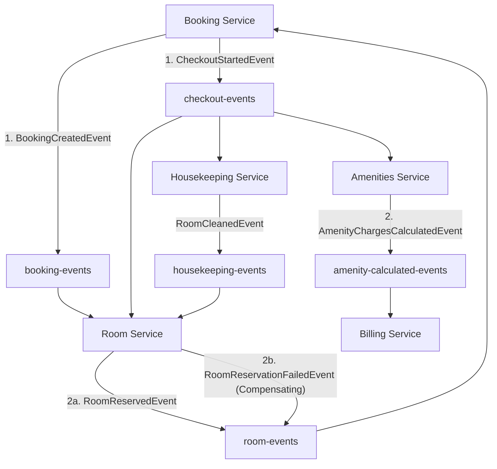

# Mổ xẻ Kiến trúc Bất đồng bộ (Kafka Event-Driven Saga) trong Smart Hotel PMS

Tài liệu này đi sâu phân tích cấu trúc kiến trúc bất đồng bộ hướng sự kiện (Event-Driven Architecture) sử dụng **Apache Kafka** để thực hiện mô hình **Saga Choreography** (Saga biên đạo) trong hệ thống **Smart Hotel PMS**. Tài liệu làm rõ luồng đi của các sự kiện, vai trò của từng dịch vụ, so sánh hiệu năng với OpenFeign, và kịch bản thực hiện lệnh bù (Compensating Transactions) để duy trì tính nhất quán dữ liệu.

---

## 1. Bản đồ Kafka Topics và Sự kiện (Events Map)

Hệ thống PMS sử dụng **5 Kafka Topics** để điều phối các luồng nghiệp vụ liên dịch vụ:



### Chi tiết các sự kiện trên từng Topic:

| # | Kafka Topic | Tên Event Class | Service gửi (Producer) | Service nhận (Consumer) | Mục đích nghiệp vụ |
| :--- | :--- | :--- | :--- | :--- | :--- |
| **1** | **`booking-events`** | [BookingCreatedEvent](file:///c:/Users/vuong/IdeaProjects/smart-hotel-pms/business-services/common-shared/src/main/java/com/smarthotel/common_shared/event/BookingCreatedEvent.java) | **Booking Service** | **Room Service** | Khởi chạy luồng giữ chỗ vật lý sau khi khách hàng tạo đơn đặt phòng trực tuyến. |
| **2** | **`room-events`** | [RoomReservedEvent](file:///c:/Users/vuong/IdeaProjects/smart-hotel-pms/business-services/common-shared/src/main/java/com/smarthotel/common_shared/event/RoomReservedEvent.java) | **Room Service** | **Booking Service** | Thông báo giữ phòng vật lý thành công $\rightarrow$ Chuyển Booking sang `AWAITING_DEPOSIT`. |
| | | [RoomReservationFailedEvent](file:///c:/Users/vuong/IdeaProjects/smart-hotel-pms/business-services/common-shared/src/main/java/com/smarthotel/common_shared/event/RoomReservationFailedEvent.java) | **Room Service** | **Booking Service** | **(Lệnh bù)** Thông báo giữ phòng thất bại do phòng đang bảo trì $\rightarrow$ Rollback Booking sang `CANCELLED`. |
| **3** | **`checkout-events`** | [CheckoutStartedEvent](file:///c:/Users/vuong/IdeaProjects/smart-hotel-pms/business-services/common-shared/src/main/java/com/smarthotel/common_shared/event/CheckoutStartedEvent.java) | **Booking Service** | **Room Service**<br/>**Amenities Service**<br/>**Housekeeping Service** | Kích hoạt chuỗi hành động đồng thời khi khách checkout: Đổi trạng thái phòng thành `DIRTY`, tính phí tiện ích chưa trả, tạo task dọn phòng. |
| **4** | **`amenity-calculated-events`** | [AmenityChargesCalculatedEvent](file:///c:/Users/vuong/IdeaProjects/smart-hotel-pms/business-services/common-shared/src/main/java/com/smarthotel/common_shared/event/AmenityChargesCalculatedEvent.java) | **Amenities Service** | **Billing Service** | Gửi tổng số tiền dịch vụ phòng chưa trả để Billing Service gom hóa đơn và áp thuế. |
| **5** | **`housekeeping-events`** | [RoomCleanedEvent](file:///c:/Users/vuong/IdeaProjects/smart-hotel-pms/business-services/common-shared/src/main/java/com/smarthotel/common_shared/event/RoomCleanedEvent.java) | **Housekeeping Service** | **Room Service** | Thông báo dọn dẹp phòng hoàn thành $\rightarrow$ Đổi trạng thái phòng vật lý thành `AVAILABLE`. |

---

## 2. So sánh OpenFeign (Đồng bộ) vs Kafka Event-Driven (Bất đồng bộ)

Các luồng đặt phòng và checkout phức tạp **bắt buộc phải sử dụng kiến trúc bất đồng bộ hướng sự kiện qua Kafka** vì 3 lý do kỹ thuật cốt lõi sau:

### 2.1. Giải phóng luồng xử lý và tối ưu hóa hiệu năng (Non-blocking Threads)
* **Nếu gọi đồng bộ (Feign):** Khi khách hàng checkout, Booking Service sẽ phải gọi Feign lần lượt tới Room Service (chờ cập nhật `DIRTY`), Housekeeping Service (chờ tạo task), Amenities Service (chờ quét và tính tiền order), và Billing Service (chờ tính thuế VAT và sinh mã QR thanh toán). Chuỗi gọi (Chain Call) này sẽ chặn (block) toàn bộ thread xử lý của request đó. Nếu hệ thống có hàng trăm khách checkout cùng lúc, Thread Pool của Gateway và Booking Service sẽ nhanh chóng bị cạn kiệt, dẫn đến sập cục bộ.
* **Với Kafka (Bất đồng bộ):** Lễ tân bấm Checkout, Booking Service đổi trạng thái booking cục bộ sang `CHECKED_OUT` và bắn 1 event duy nhất `CheckoutStartedEvent` lên Kafka (mất chưa đầy 5ms) rồi phản hồi ngay cho lễ tân. Việc tính tiền, dọn phòng, khóa phòng diễn ra song song dưới nền, không chiếm dụng luồng của API Gateway.

### 2.2. Khả năng chịu lỗi cao (Fault Tolerance & Temporal Decoupling)
* **Nếu gọi đồng bộ (Feign):** Nếu tại thời điểm checkout, `Billing Service` hoặc `Housekeeping Service` bị sập đột ngột, toàn bộ giao dịch checkout qua REST API sẽ thất bại (Http 500), lễ tân không thể in hóa đơn hay giải phóng khách.
* **Với Kafka (Bất đồng bộ):** Nếu `Billing Service` sập, tin nhắn checkout vẫn nằm an toàn trong phân vùng (Partition) của Kafka Broker. Khi `Billing Service` được khởi động lại, nó sẽ tiếp tục đọc từ offset cũ và tự động sinh hóa đơn muộn hơn vài giây mà không làm mất mát dữ liệu hay làm gián đoạn công việc của lễ tân.

### 2.3. Nhất quán dữ liệu cuối cùng thay vì khóa cơ sở dữ liệu (Eventual Consistency)
* Quy trình nghiệp vụ khách sạn không yêu cầu tính nhất quán tức thời (Strong Consistency). Việc nhân viên buồng phòng nhận được task dọn dẹp chậm hơn 1-2 giây hay hóa đơn được hiển thị muộn hơn một vài giây không ảnh hưởng đến trải nghiệm của khách.
* Việc áp dụng kiến trúc Event-Driven Saga giúp hệ thống duy trì **Tính nhất quán dữ liệu cuối cùng (Eventual Consistency)** mà không cần sử dụng Distributed Transactions (như 2PC - Two-Phase Commit vốn cực kỳ đắt đỏ và làm giảm băng thông hệ thống).

---

## 3. Kịch bản chạy Lệnh Bù (Compensating Transaction) khi Đặt Phòng lỗi

Mô hình **Saga Choreography** quản lý luồng rollback thông qua các Lệnh bù (Compensating Events) để đảm bảo dữ liệu giữa các DB phân tán luôn nhất quán khi có bước trung gian bị lỗi.

Dưới đây là kịch bản chi tiết khi khách hàng đặt phòng trực tuyến nhưng phòng đó đang bị lỗi bảo trì:

```mermaid
sequenceDiagram
    autonumber
    actor Client as Khách hàng
    participant Booking as Booking Service (DB)
    participant Kafka as Kafka Broker (Topics)
    participant Room as Room Service (DB)

    Client->>Booking: POST /api/bookings (Đặt phòng)
    Note over Booking: 1. Tạo Booking trạng thái PENDING
    Booking->>Kafka: Publish "BookingCreatedEvent" trên topic "booking-events"
    Booking-->>Client: Trả về phản hồi Http 201 (Đặt phòng đang xử lý...)
    
    Kafka->>Room: Consume "BookingCreatedEvent"
    Note over Room: 2. Kiểm tra trạng thái phòng vật lý trong Room DB
    alt Phòng đang ở trạng thái MAINTENANCE (Bảo trì)
        Note over Room: Không thể giữ phòng!
        Room->>Kafka: Publish "RoomReservationFailedEvent" trên topic "room-events"
    end

    Kafka->>Booking: Consume "RoomReservationFailedEvent"
    Note over Booking: 3. Nhận sự kiện thất bại (Kích hoạt Lệnh bù)
    Note over Booking: 4. Kiểm tra Idempotency (Trạng thái phải là PENDING)
    Note over Booking: 5. Cập nhật trạng thái Booking sang CANCELLED
    log over Booking: DB được đưa về trạng thái nhất quán thất bại thành công!
```

### Chi tiết các bước xử lý lệnh bù trong code:

1. **Khởi tạo giao dịch (Saga Start):**
   * Khách hàng gửi yêu cầu đặt phòng. `BookingService` lưu bản ghi `Booking` vào Database của mình với trạng thái là **`PENDING`**.
   * `BookingService` bắn sự kiện [BookingCreatedEvent](file:///c:/Users/vuong/IdeaProjects/smart-hotel-pms/business-services/common-shared/src/main/java/com/smarthotel/common_shared/event/BookingCreatedEvent.java) lên topic `booking-events`.
2. **Kiểm tra nghiệp vụ downstream:**
   * Dịch vụ `Room Service` lắng nghe topic `booking-events` thông qua [RoomSagaConsumer](file:///c:/Users/vuong/IdeaProjects/smart-hotel-pms/business-services/room-service/src/main/java/com/smarthotel/room_service/messaging/consumer/RoomSagaConsumer.java#L29-L31).
   * Nó thực hiện truy vấn trạng thái phòng vật lý. Phát hiện phòng này đang ở trạng thái **`MAINTENANCE`** (Bảo trì do hỏng hóc).
3. **Kích hoạt Lệnh Bù (Compensating Trigger):**
   * Do phòng không sẵn sàng, `Room Service` không thể cập nhật phòng thành `OCCUPIED`. 
   * Nó đóng vai trò là tác nhân kích hoạt lệnh bù bằng cách sinh ra và gửi sự kiện [RoomReservationFailedEvent](file:///c:/Users/vuong/IdeaProjects/smart-hotel-pms/business-services/common-shared/src/main/java/com/smarthotel/common_shared/event/RoomReservationFailedEvent.java) lên topic `room-events`.
4. **Thực thi Lệnh Bù (Compensating Action):**
   * Dịch vụ `Booking Service` lắng nghe topic `room-events` thông qua [BookingSagaConsumer](file:///c:/Users/vuong/IdeaProjects/smart-hotel-pms/business-services/booking-service/src/main/java/com/smarthotel/booking_service/messaging/consumer/BookingSagaConsumer.java#L51-L53).
   * Khi nhận được `RoomReservationFailedEvent`, consumer thực hiện truy vấn bản ghi Booking theo `bookingId` nhận được từ event.
   * **Bảo vệ tính trùng lặp (Idempotency Check):** Nó kiểm tra xem trạng thái của đơn hàng có đang là `PENDING` hay không. Nếu đơn hàng đã xử lý xong hoặc bị hủy trước đó, nó bỏ qua để tránh ghi đè dữ liệu sai lệch.
   * **Cập nhật CSDL (Rollback):** Đơn hàng Booking được đổi trạng thái từ `PENDING` sang **`CANCELLED`** và cập nhật vào Database của Booking Service. 
   * Quá trình rollback hoàn tất, giải phóng các tài nguyên liên quan một cách an toàn.
