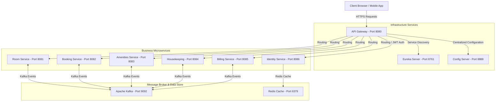

# Smart Hotel PMS (Property Management System)

Hệ thống Quản lý Khách sạn Thông minh (Smart Hotel PMS) là một hệ sinh thái microservices xây dựng trên nền tảng **Java 17**, **Spring Boot 3.2.3** và **Spring Cloud 2023.0.0**. Hệ thống tự động hóa toàn bộ quy trình vận hành khách sạn từ tìm kiếm, đặt phòng trực tuyến, quản lý buồng phòng, gọi dịch vụ phòng, cho đến tự động hóa hóa đơn và thanh toán.

---

## 1. Kiến Trúc Hệ Thống (Architecture Overview)

Hệ thống được thiết kế theo mô hình **Microservices Kiến trúc phân tán** sử dụng luồng **Choreography Saga thuần túy** (dựa hoàn toàn trên sự kiện Apache Kafka) để phối hợp các tác vụ giao dịch phân tán (Đặt phòng, Trả phòng, Gộp hóa đơn tiện ích và Tính tiền). 

Cơ chế giao tiếp đồng bộ (REST Feign Client) được tối giản hóa và chỉ sử dụng cho các truy vấn tra cứu thông tin (Read-only lookup) hoặc cập nhật trực tiếp trạng thái phòng vật lý, đồng thời được bảo vệ bởi **Resilience4j Circuit Breakers** & **Timeouts** được cấu hình tập trung cùng cơ chế **Fallback** an toàn.



---

## 2. Công Nghệ Sử Dụng (Technology Stack)

* **Ngôn ngữ chính**: Java 17
* **Framework chính**: Spring Boot 3.2.3 & Spring Cloud 2023.0.0
* **Routing & Security**: Spring Cloud Gateway (với bộ lọc AuthenticationFilter tùy biến)
* **Service Discovery**: Netflix Eureka Server
* **Quản lý cấu hình tập trung**: Spring Cloud Config Server (lưu trữ tệp YAML)
* **Cơ sở dữ liệu**: PostgreSQL 15 (Mỗi service sở hữu một DB độc lập - Database-per-Service)
* **Cơ chế Cache**: Redis Cache (dùng cho Token Blacklist và tăng tốc truy vấn)
* **Truyền tin & Điều phối**: Apache Kafka (Kiến trúc Choreography Saga thuần túy qua các Event topics)
* **Tự chịu lỗi & Kháng lỗi**: Resilience4j (Circuit Breaker & Timeouts: Connect Timeout 2s, Read Timeout 5s)
* **Công cụ build**: Maven

---

## 3. Cấu Trúc Thư Mục Dự Án (Workspace Structure)

Dự án được cấu trúc dưới dạng **Maven Multi-Module** giúp quản lý phụ thuộc (dependencies) tập trung và phân chia ranh giới các nghiệp vụ rõ ràng:

```text
smart-hotel-pms/                  # Thư mục gốc dự án
├── pom.xml                       # POM cha quản lý dependency & plugin
├── docker-compose.yml            # Khởi tạo hạ tầng DB, Kafka, Redis cục bộ
├── README.md                     # Tài liệu hướng dẫn dự án
├── SYSTEM_LOGIC_OPERATIONS.md    # Tài liệu đặc tả luồng xử lý và sự kiện
│
├── infrastructure-services/      # Các dịch vụ hạ tầng hệ thống
│   ├── config-server/            # Centralized Configuration (Port 8888)
│   │   └── src/main/resources/configfiles/   # Chứa các file YAML cấu hình dịch vụ
│   ├── eureka-server/            # Service Registry & Discovery (Port 8761)
│   └── api-gateway/              # API Gateway xử lý Routing & Auth (Port 8080)
│
└── business-services/            # Các dịch vụ nghiệp vụ cốt lõi
    ├── common-shared/            # Thư viện dùng chung (Event payloads, Common Models, Security)
    ├── identity-service/         # Quản lý tài khoản, phân quyền RBAC & Auth (Port 8086)
    ├── room-service/             # Quản lý phòng vật lý, trạng thái phòng & giá (Port 8081)
    ├── booking-service/          # Quản lý đặt phòng, Check-in, Check-out (Port 8082)
    ├── amenities-service/        # Quản lý dịch vụ đi kèm & đặt đồ ăn/uống (Port 8083)
    ├── housekeeping-service/     # Quản lý dọn phòng, phân công công việc (Port 8084)
    └── billing-service/          # Tính toán hóa đơn, thanh toán QR (Port 8085)
```

---

## 4. Chi Tiết Dịch Vụ Nghiệp Vụ (Business Services Details)

### 4.1. Identity Service (Cổng 8086)
* **Nhiệm vụ**: Xác thực người dùng (Đăng ký, Đăng nhập), quản lý phân quyền (Admin, Receptionist, Housekeeper, Customer).
* **Cơ sở dữ liệu**: `hotel_identity_db` (Port: `5431`).

### 4.2. Room Service (Cổng 8081)
* **Nhiệm vụ**: Quản lý danh mục loại phòng, số lượng phòng vật lý, cập nhật trạng thái phòng.
* **Saga**: Lắng nghe `BookingCreatedEvent` từ Kafka, kiểm tra tình trạng bảo trì vật lý của phòng để bắn `RoomReservedEvent` (giữ phòng thành công) hoặc `RoomReservationFailedEvent` (thất bại).
* **Cơ sở dữ liệu**: `hotel_room_db` (Port: `5436`).

### 4.3. Booking Service (Cổng 8082)
* **Nhiệm vụ**: Xử lý toàn bộ vòng đời đặt phòng.
  * **Đặt phòng trực tuyến**: Chỉ dành cho vai trò `CUSTOMER`. Hệ thống kiểm tra trùng lịch đặt phòng cục bộ tức thì (**Fail-Fast**), tạo đơn `PENDING` và bắn sự kiện `BookingCreatedEvent`.
  * **Check-in trực tiếp**: Nhận phòng bằng cách xác nhận đơn đặt phòng `CONFIRMED`, cập nhật cục bộ sang `CHECKED_IN` và gọi đồng bộ cập nhật trạng thái phòng vật lý sang `OCCUPIED` (Feign Client được cấu hình Resilience4j Fallback).
  * **Tìm kiếm phòng trống**: Expose API `GET /api/bookings/search-available-rooms` bằng cách đối chiếu phòng vật lý từ Room Service với lịch bận tại local DB.
  * **Check-out**: Cập nhật trạng thái booking sang `CHECKED_OUT` và phát sự kiện `CheckoutStartedEvent` chứa `roomCharge` (tiền phòng thực tế) và `depositAmount` (tiền cọc).
* **Cơ sở dữ liệu**: `hotel_booking_db` (Port: `5432`).

### 4.4. Amenities Service (Cổng 8083)
* **Nhiệm vụ**: Gọi đồ ăn uống/dịch vụ tại phòng.
  * **Quy tắc nghiêm ngặt**: Khách hàng chỉ được phép đặt dịch vụ phòng khi phòng ở trạng thái nhận phòng (`CHECKED_IN`).
  * **Gọi đồ**: Hệ thống gọi Feign Client đồng bộ sang `booking-service` (`GET /api/bookings/active/room/{roomId}`) để xác thực trạng thái phòng và tự động lấy `bookingId`. Đơn hàng được lưu thẳng sang trạng thái `PREPARING` (không cần SAGA xác thực không đồng bộ).
  * **Thanh toán dịch vụ khi Checkout**: Lắng nghe sự kiện `CheckoutStartedEvent`, tìm các đơn hàng dịch vụ chưa thanh toán của phòng, chuyển sang trạng thái `BILLED`, cộng tổng số tiền dịch vụ (`serviceCharge`) và phát sự kiện `AmenityChargesCalculatedEvent` lên Kafka.
* **Cơ sở dữ liệu**: `hotel_amenities_db` (Port: `5433`).

### 4.5. Housekeeping Service (Cổng 8084)
* **Nhiệm vụ**: Tự động tạo tác vụ dọn dẹp khi phòng được trả (Check-out) hoặc khách có yêu cầu.
* **Cơ sở dữ liệu**: `hotel_housekeeping_db` (Port: `5434`).

### 4.6. Billing Service (Cổng 8085)
* **Nhiệm vụ**: Tổng hợp hóa đơn tổng (không còn API generate thủ công).
  * **Saga**: Lắng nghe sự kiện `AmenityChargesCalculatedEvent`, trích xuất `roomCharge`, `serviceCharge` và `depositAmount`.
  * **Tính toán**: Áp dụng công thức `Tổng tiền = (Tiền phòng + Tiền dịch vụ) * 1.1 (Thuế VAT 10%) - Tiền đặt cọc`. Hóa đơn được tạo tự động dưới trạng thái `UNPAID` trong Database.
* **Cơ sở dữ liệu**: `hotel_billing_db` (Port: `5435`).

---

## 5. Phân Định Cơ Sở Dữ Liệu (Database Topology)

Hệ thống tuân thủ nghiêm ngặt mô hình **Database-per-Service** (Mỗi dịch vụ sở hữu cơ sở dữ liệu riêng biệt), tránh việc các dịch vụ chia sẻ kết nối trực tiếp đến bảng của nhau.

| Tên Dịch Vụ | Tên Cơ Sở Dữ Liệu | Cổng Host | User Database |
| :--- | :--- | :--- | :--- |
| **identity-service** | `hotel_identity_db` | `5431` | `user_identity` |
| **room-service** | `hotel_room_db` | `5436` | `user_room` |
| **booking-service** | `hotel_booking_db` | `5432` | `user_booking` |
| **amenities-service** | `hotel_amenities_db` | `5433` | `user_amenities` |
| **housekeeping-service**| `hotel_housekeeping_db`| `5434` | `user_housekeeping` |
| **billing-service** | `hotel_billing_db` | `5435` | `user_billing` |

---

## 6. Hướng Dẫn Cài Đặt và Khởi Chạy (Local Setup & Run)

### 6.1. Chuẩn bị môi trường (Prerequisites)
* Java 17 hoặc cao hơn.
* Maven 3.8.x hoặc cao hơn.
* Docker Desktop đã được cài đặt và đang chạy.

### 6.2. Các bước khởi chạy

#### Bước 1: Khởi động các Container Hạ tầng (PostgreSQL, Redis, Kafka)
Chạy lệnh sau tại thư mục gốc chứa file `docker-compose.yml`:
```bash
docker compose up -d
```

#### Bước 2: Build dự án bằng Maven
Chạy lệnh biên dịch và cài đặt các thư viện phụ thuộc:
```bash
mvn clean install -DskipTests
```

#### Bước 3: Khởi chạy các Dịch vụ Hạ tầng hệ thống (Bắt buộc theo thứ tự)
1. Khởi chạy **Config Server** (`ConfigServerApplication.java`).
2. Khởi chạy **Eureka Server** (`EurekaServerApplication.java`).
3. Khởi chạy **API Gateway** (`ApiGatewayApplication.java`).

#### Bước 4: Khởi chạy các Dịch vụ Nghiệp vụ
Khởi chạy lần lượt các ứng dụng Spring Boot chính:
* `IdentityServiceApplication`
* `RoomServiceApplication`
* `BookingServiceApplication`
* `AmenitiesServiceApplication`
* `HousekeepingServiceApplication`
* `BillingApplication`

---

## 7. Tiêu Chuẩn Thiết Kế Mã Nguồn (Code Standards)

* **Choreography Saga**: Các giao dịch liên microservice thực hiện dựa trên cơ chế gửi/nhận sự kiện Kafka bất đồng bộ qua các topic (`booking-events`, `room-events`, `checkout-events`, `amenity-calculated-events`), đảm bảo tính lỏng lẻo và khả năng mở rộng.
* **Bảo vệ bằng Circuit Breaker**: Tất cả các cuộc gọi đồng bộ Feign Client được bọc bởi cấu hình Resilience4j tập trung cùng các lớp Fallback để đảm bảo hệ thống không bị đổ sụp dây chuyền (Cascading Failure).
* **Decoupled Transactions**: Thực hiện các cuộc gọi mạng (REST/Kafka) bên ngoài các khối giao dịch `@Transactional` để tránh chiếm dụng và gây nghẽn kết nối database pool.
* **Global Exception Handler**: Tất cả các lỗi nghiệp vụ đều được bắt tập trung tại lớp `@ControllerAdvice` của từng dịch vụ và trả về định dạng JSON chuẩn.
