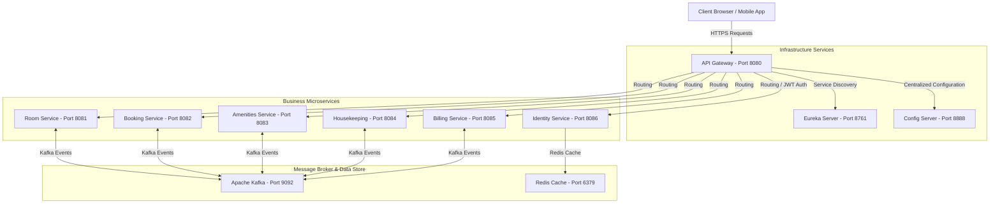

# Smart Hotel PMS (Property Management System)

Hệ thống Quản lý Khách sạn Thông minh (Smart Hotel PMS) là một hệ sinh thái microservices xây dựng trên nền tảng **Java 17**, **Spring Boot 3.2.3** và **Spring Cloud 2023.0.0**. Hệ thống hỗ trợ tự động hóa toàn bộ quy trình vận hành khách sạn từ đặt phòng, quản lý buồng phòng, dịch vụ phòng, cho đến tính tiền và xuất hóa đơn.

---

## 1. Kiến Trúc Hệ Thống (Architecture Overview)

Hệ thống được thiết kế theo mô hình **Microservices Kiến trúc phân tán** kết hợp cơ chế giao tiếp đồng bộ (REST Feign Client) và bất đồng bộ (Kafka Event-driven) để đạt hiệu năng và khả năng chịu tải tốt nhất.



---

## 2. Công Nghệ Sử Dụng (Technology Stack)

* **Ngôn ngữ chính**: Java 17
* **Framework chính**: Spring Boot 3.2.3 & Spring Cloud 2023.0.0
* **Routing & Security**: Spring Cloud Gateway (với bộ lọc AuthenticationFilter tùy biến)
* **Service Discovery**: Netflix Eureka Server
* **Quản lý cấu hình tập trung**: Spring Cloud Config Server (lưu trữ tệp YAML)
* **Cơ sở dữ liệu**: PostgreSQL 15 (Mỗi service sở hữu một DB độc lập - Database-per-Service)
* **Cơ chế Cache**: Redis Cache (dùng cho Token Blacklist và tăng tốc truy vấn)
* **Truyền tin & Điều phối**: Apache Kafka (quản lý luồng Sự kiện/Saga Orchestration)
* **Công cụ build**: Maven

---

## 3. Cấu Trúc Thư Mục Dự Án (Workspace Structure)

Dự án được cấu trúc dưới dạng **Maven Multi-Module** giúp quản lý phụ thuộc (dependencies) tập trung và phân chia ranh giới các nghiệp vụ rõ ràng:

```text
smart-hotel-pms/                  # Thư mục gốc dự án
├── pom.xml                       # POM cha quản lý dependency & plugin
├── docker-compose.yml            # Khởi tạo hạ tầng DB, Kafka, Redis cục bộ
├── README.md                     # Tài liệu hướng dẫn dự án
│
├── infrastructure-services/      # Các dịch vụ hạ tầng hệ thống
│   ├── config-server/            # Centralized Configuration (Port 8888)
│   │   └── src/main/resources/configfiles/   # Chứa các file YAML cấu hình dịch vụ
│   ├── eureka-server/            # Service Registry & Discovery (Port 8761)
│   └── api-gateway/              # API Gateway xử lý Routing & Auth (Port 8080)
│
└── business-services/            # Các dịch vụ nghiệp vụ cốt lõi
    ├── common-shared/            # Thư viện dùng chung (Event payloads, Common Models, Security)
    ├── identity-service/         # Quản lý tài khoản, phân quyền RBAC & Auth (Port 8086)
    ├── room-service/             # Quản lý phòng vật lý, trạng thái phòng & giá (Port 8081)
    ├── booking-service/          # Quản lý đặt phòng, Check-in, Check-out (Port 8082)
    ├── amenities-service/        # Quản lý dịch vụ đi kèm & đặt đồ ăn/uống (Port 8083)
    ├── housekeeping-service/     # Quản lý dọn phòng, phân công công việc (Port 8084)
    └── billing-service/          # Tính toán hóa đơn, thanh toán QR (Port 8085)
```

---

## 4. Chi Tiết Dịch Vụ Nghiệp Vụ (Business Services Details)

### 4.1. Identity Service (Cổng 8086)
* **Nhiệm vụ**: Xác thực người dùng (Đăng ký, Đăng nhập), quản lý phân quyền (Admin, Receptionist, Housekeeper, Customer).
* **Bảo mật**: Sử dụng cơ chế Token Rotation (Access Token thời gian ngắn & Refresh Token luân phiên). Tích hợp Redis để lưu trữ danh sách Token bị thu hồi (Blacklist) nhằm ngăn chặn Session Hijacking.
* **Cơ sở dữ liệu**: `hotel_identity_db` (Port: `5431`).

### 4.2. Room Service (Cổng 8081)
* **Nhiệm vụ**: Quản lý danh mục loại phòng, số lượng phòng vật lý, cập nhật trạng thái phòng (AVAILABLE, BOOKED, DIRTY, CLEANING).
* **Cơ sở dữ liệu**: `hotel_room_db` (Port: `5436`).

### 4.3. Booking Service (Cổng 8082)
* **Nhiệm vụ**: Xử lý toàn bộ vòng đời đặt phòng. Hỗ trợ tính năng tính toán giá trị đặt phòng trước, đặt trước phòng, thực hiện Check-in và Check-out.
* **Tích hợp**: Gọi Feign Client sang `room-service` để kiểm tra trạng thái phòng và gọi `billing-service` để tự động hóa quy trình Check-out và thanh toán.
* **Cơ sở dữ liệu**: `hotel_booking_db` (Port: `5432`).

### 4.4. Amenities Service (Cổng 8083)
* **Nhiệm vụ**: Quản lý danh sách dịch vụ gia tăng (Spa, Buffet, Bar, Giặt là). Ghi nhận các yêu cầu đặt dịch vụ từ phòng của khách (Amenity Orders).
* **Cơ sở dữ liệu**: `hotel_amenities_db` (Port: `5433`).

### 4.5. Housekeeping Service (Cổng 8084)
* **Nhiệm vụ**: Tự động tạo tác vụ dọn dẹp khi phòng được trả (Check-out) hoặc khách có yêu cầu. Hỗ trợ cập nhật tiến độ công việc dọn dẹp của nhân viên.
* **Giao tiếp**: Lắng nghe sự kiện Check-out qua Kafka để chuyển trạng thái phòng thành `DIRTY` và phân công tác vụ dọn dẹp.
* **Cơ sở dữ liệu**: `hotel_housekeeping_db` (Port: `5434`).

### 4.6. Billing Service (Cổng 8085)
* **Nhiệm vụ**: Tổng hợp tiền phòng thực tế ở kèm chi phí dịch vụ gia tăng đã sử dụng trong suốt kỳ nghỉ của khách để xuất hóa đơn tổng.
* **Thanh toán**: Sinh mã VietQR động dựa trên số tiền hóa đơn. Xác thực thanh toán thông qua API mô phỏng ngân hàng.
* **Cơ sở dữ liệu**: `hotel_billing_db` (Port: `5435`) sử dụng Flyway để kiểm soát phiên bản database schema migration.

---

## 5. Phân Định Cơ Sở Dữ Liệu (Database Topology)

Hệ thống tuân thủ nghiêm ngặt mô hình **Database-per-Service** (Mỗi dịch vụ sở hữu cơ sở dữ liệu riêng biệt), tránh việc các dịch vụ chia sẻ kết nối trực tiếp đến bảng của nhau.

| Tên Dịch Vụ | Tên Cơ Sở Dữ Liệu | Cổng Host | User Database |
| :--- | :--- | :--- | :--- |
| **identity-service** | `hotel_identity_db` | `5431` | `user_identity` |
| **room-service** | `hotel_room_db` | `5436` | `user_room` |
| **booking-service** | `hotel_booking_db` | `5432` | `user_booking` |
| **amenities-service** | `hotel_amenities_db` | `5433` | `user_amenities` |
| **housekeeping-service**| `hotel_housekeeping_db`| `5434` | `user_housekeeping` |
| **billing-service** | `hotel_billing_db` | `5435` | `user_billing` |

---

## 6. Hướng Dẫn Cài Đặt và Khởi Chạy (Local Setup & Run)

### 6.1. Chuẩn bị môi trường (Prerequisites)
* Java 17 hoặc cao hơn.
* Maven 3.8.x hoặc cao hơn.
* Docker Desktop đã được cài đặt và đang chạy.

### 6.2. Các bước khởi chạy

#### Bước 1: Khởi động các Container Hạ tầng (PostgreSQL, Redis, Kafka)
Chạy lệnh sau tại thư mục gốc chứa file `docker-compose.yml`:
```bash
docker compose up -d
```
Đợi khoảng 1-2 phút để các container khởi động hoàn tất và kiểm tra trạng thái hoạt động của các DB.

#### Bước 2: Build dự án bằng Maven
Chạy lệnh biên dịch và cài đặt các thư viện phụ thuộc (bao gồm `common-shared`):
```bash
mvn clean install -DskipTests
```

#### Bước 3: Khởi chạy các Dịch vụ Hạ tầng hệ thống (Bắt buộc theo thứ tự)
1. Khởi chạy **Config Server** (`ConfigServerApplication.java`): Cung cấp cấu hình YAML tập trung cho hệ thống.
2. Khởi chạy **Eureka Server** (`EurekaServerApplication.java`): Service Discovery giúp các microservices tìm thấy nhau.
3. Khởi chạy **API Gateway** (`ApiGatewayApplication.java`): Định tuyến cuộc gọi API từ client và kiểm soát Token bảo mật.

#### Bước 4: Khởi chạy các Dịch vụ Nghiệp vụ
Khởi chạy lần lượt các ứng dụng Spring Boot chính:
* `IdentityServiceApplication`
* `RoomServiceApplication`
* `BookingServiceApplication`
* `AmenitiesServiceApplication`
* `HousekeepingServiceApplication`
* `BillingApplication`

---

## 7. Tiêu Chuẩn Thiết Kế Mã Nguồn (Code Standards)

* **Kiến trúc Layered**: Các microservices đều phân chia package chuẩn bao gồm `controller`, `service`, `repository`, `entity`, `dto`, `client` (Feign client) và `messaging` (Kafka).
* **Centralized Configuration**: Tuyệt đối không khai báo cấu hình nhạy cảm (Credentials, Ports, Hosts) cục bộ. Tất cả cấu hình đều được tải động từ Config Server.
* **DTO Mapping**: Sử dụng `ModelMapper` hoặc cấu trúc Java `record` thuần túy để chuyển đổi dữ liệu an toàn giữa các lớp Entity và DTO.
* **Global Exception Handler**: Tất cả các lỗi nghiệp vụ đều được bắt tập trung tại lớp `@ControllerAdvice` của từng dịch vụ và trả về định dạng JSON chuẩn (mã lỗi HTTP tương ứng).
